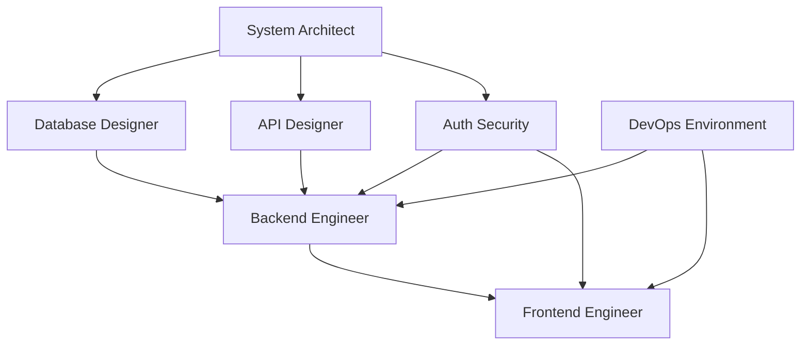

# Skills Directory

This directory contains skill definitions for the ToDo App Phase 2 project following Spec-Driven Development (SDD) methodology.

## Available Skills

### 1. System Architect (`system-architect.md`)
**Description**: Defines coding rules, project structure, monorepo layout, and enforces Spec 0 Constitution rules.

**Components**:
- Generate Spec 0 – Constitution file (`/specs/constitution.md`)
- Generate Spec 1 – Project Structure file (`/specs/spec-1-project-structure.md`)
- Enforce coding, security, REST, and folder standards

**Reusable**: Yes, can be reused for other Spec-Driven projects
**Called by**: Main Agent / Sub-Agent

---

### 2. Database Designer (`database-designer.md`)
**Description**: Designs PostgreSQL database schema and SQLModel models for the ToDo app.

**Components**:
- Create User and Task tables
- Define relationships and ownership (user_id)
- Include completion status, timestamps
- Output Spec-Kit Plus compatible DB spec

**Reusable**: Yes, reusable in other database projects
**Called by**: Main Agent / Database Designer Sub-Agent

---

### 3. Backend Engineer (`backend-engineer.md`)
**Description**: Implements FastAPI backend endpoints, handles CRUD operations, and enforces JWT authentication.

**Components**:
- `GET /api/{user_id}/tasks`
- `POST /api/{user_id}/tasks`
- `PUT /api/{user_id}/tasks/{id}`
- `DELETE /api/{user_id}/tasks/{id}`
- `PATCH /api/{user_id}/tasks/{id}/complete`
- Validate JWT and user ownership

**Reusable**: Yes, can be reused for other FastAPI projects
**Called by**: Main Agent / Backend Engineer Sub-Agent

---

### 4. API Designer (`api-design.md`)
**Description**: Designs RESTful API endpoints, ensures validation, proper HTTP status codes, and follows Spec 0 rules.

**Components**:
- Define all API endpoints for ToDo tasks
- Validate input and output
- Return proper HTTP status codes
- Filter tasks by authenticated user

**Reusable**: Yes, reusable for any REST API project
**Called by**: Backend Engineer Sub-Agent / Main Agent

---

### 5. Auth Security (`auth-security.md`)
**Description**: Handles Better Auth + JWT integration for secure frontend-backend communication.

**Components**:
- Issue JWT tokens
- Verify tokens in FastAPI middleware
- Reject unauthorized requests (401)
- Map user_id from token to resource ownership

**Reusable**: Yes, reusable for other secure web apps
**Called by**: Main Agent / Auth/Security Engineer Sub-Agent

---

### 6. DevOps Environment (`devops-env.md`)
**Description**: Manages environment variables and secrets for secure deployment and runtime configuration.

**Components**:
- Configure `DB_URL`, `JWT_SECRET`, `BETTER_AUTH_SECRET`
- Ensure secure storage of secrets
- Provide env variables to backend and frontend

**Reusable**: Yes, reusable for other projects
**Called by**: Main Agent / DevOps Sub-Agent

---

### 7. Frontend Engineer (`frontend-engineer.md`)
**Description**: Builds Next.js frontend pages and components, integrates APIs, and handles JWT tokens.

**Components**:
- Task list page
- Create, edit, delete, toggle complete tasks
- Attach JWT token to API calls
- Clean component structure

**Reusable**: Yes, reusable for other Next.js projects
**Called by**: Main Agent / Frontend Engineer Sub-Agent

---

### 8. UI/UX Designer (`ui-ux.md`)
**Description**: Designs responsive and user-friendly UI for applications with focus on accessibility and visual consistency.

**Components**:
- Responsive layout for desktop and mobile
- Clean and accessible component design
- Consistent UI with Spec 0 rules

**Reusable**: Yes, reusable for other frontend projects
**Called by**: Main Agent / Frontend Engineer Sub-Agent

---

## Skill Invocation Pattern

Skills are invoked by the main agent or sub-agents using the following pattern:

```bash
# General format
/[skill-name] [command] [options]

# Examples
/system-architect init
/database-designer schema
/backend-engineer implement-crud --resource tasks
/api-design create --resource tasks
/auth-security setup
/devops-env generate-secrets
/frontend-engineer tasks-ui
/ui-ux design-system
```

## Skill Hierarchy

```
Main Agent
├── System Architect
│   ├── Constitution Generation
│   └── Project Structure Documentation
│
├── Database Designer
│   ├── Schema Design
│   └── SQLModel Generation
│
├── API Designer
│   └── REST Contract Specification
│
├── Backend Engineer
│   ├── FastAPI Endpoints
│   ├── CRUD Operations
│   └── JWT Middleware
│
├── Auth Security
│   ├── Better Auth Setup
│   ├── JWT Token Management
│   └── User Ownership Validation
│
├── DevOps Environment
│   ├── Environment Configuration
│   ├── Secret Management
│   └── Deployment Setup
│
├── UI/UX Designer
│   ├── Design System
│   ├── Responsive Layouts
│   └── Accessibility Standards
│
└── Frontend Engineer
    ├── Next.js Pages
    ├── React Components
    ├── API Integration
    └── Protected Routes
```

## Development Workflow

### Phase 1: Architecture & Planning
1. **System Architect**: Define constitution and project structure
2. **Database Designer**: Design database schema
3. **API Designer**: Specify REST API contracts

### Phase 2: Backend Implementation
1. **Auth Security**: Setup JWT authentication
2. **Backend Engineer**: Implement FastAPI endpoints
3. **DevOps Environment**: Configure environment variables

### Phase 3: Frontend Implementation
1. **UI/UX Designer**: Define design system and responsive layouts
2. **Frontend Engineer**: Build Next.js UI components
3. **Auth Security**: Integrate Better Auth
4. **Frontend Engineer**: Connect to backend APIs

### Phase 4: Integration & Testing
1. All skills collaborate on integration testing
2. Security audit across all layers
3. Performance optimization
4. Deployment preparation

## Skill Dependencies



**Key Dependencies**:
- **Database Designer** depends on **System Architect** for standards
- **API Designer** depends on **System Architect** for REST conventions
- **Backend Engineer** depends on **Database Designer**, **API Designer**, and **Auth Security**
- **UI/UX Designer** depends on **System Architect** for design consistency rules
- **Frontend Engineer** depends on **Auth Security**, **Backend Engineer** (API contracts), and **UI/UX Designer** (design system)
- **DevOps Environment** provides configuration to both **Backend** and **Frontend**

## Best Practices

### When Creating New Skills

1. **Clear Scope**: Define exact responsibilities and boundaries
2. **Reusability**: Design for reuse across projects
3. **Documentation**: Include comprehensive examples and templates
4. **Integration**: Specify dependencies and integration points
5. **Testing**: Include testing strategies and examples
6. **Security**: Address security considerations explicitly
7. **SDD Compliance**: Follow Spec-Driven Development principles

### When Using Skills

1. **Check Dependencies**: Ensure prerequisite skills have been executed
2. **Validate Outputs**: Verify artifacts match specifications
3. **Document Decisions**: Create ADRs for significant choices
4. **Test Incrementally**: Test after each skill execution
5. **Follow Workflow**: Execute skills in logical order
6. **Review Integration**: Ensure skills work together correctly

## Output Artifacts by Skill

| Skill | Primary Artifacts | Location |
|-------|------------------|----------|
| System Architect | Constitution, Project Structure | `/specs/constitution.md`, `/specs/spec-1-project-structure.md` |
| Database Designer | Schema Specification | `/specs/database/schema.md` |
| API Designer | REST Endpoints Spec | `/specs/api/rest-endpoints.md` |
| Backend Engineer | FastAPI Implementation | `/backend/app/` |
| Auth Security | Auth Specification, Middleware | `/specs/auth/`, `/backend/app/dependencies/auth.py` |
| DevOps Environment | Env Templates, Config Loaders | `.env.example`, `/backend/app/config.py` |
| UI/UX Designer | Design System, Style Guide | `/specs/ui/design-system.md`, `/frontend/styles/` |
| Frontend Engineer | Next.js Pages & Components | `/frontend/app/`, `/frontend/components/` |

## Skill Maintenance

### Version Control
- Each skill is versioned independently
- Version history tracked at end of skill document
- Breaking changes documented in skill header

### Updates
- Skills updated when new patterns emerge
- Backward compatibility maintained when possible
- Migration guides provided for breaking changes

### Review Cycle
- Skills reviewed after each project completion
- Lessons learned incorporated into skill definitions
- Best practices updated based on real-world usage

## Contributing

When adding new skills:

1. Follow the existing skill template structure
2. Include all required sections (Overview, Components, Usage, etc.)
3. Provide comprehensive code examples
4. Document integration points with other skills
5. Add security considerations
6. Include testing strategies
7. Update this README with the new skill

## Support

For questions or issues with skills:
1. Review the skill documentation thoroughly
2. Check integration points with dependent skills
3. Verify all prerequisites are met
4. Consult the project's Spec 0 Constitution
5. Create an issue if problems persist

---

**Last Updated**: 2026-01-02
**Total Skills**: 8
**Project**: ToDo App Phase 2
